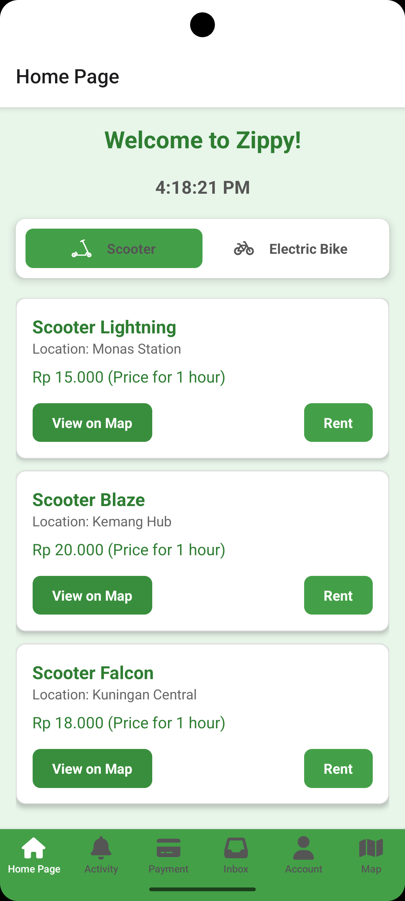

# ZIPPY - Mobilitas Cepat dan Efisien

ZIPPY adalah aplikasi mobile yang dirancang untuk memberikan solusi mobilitas cepat dan efisien. Aplikasi ini memungkinkan pengguna untuk menyewa kendaraan roda dua seperti scooter dan sepeda listrik untuk perjalanan mereka, terutama untuk pengguna yang membutuhkan transportasi tambahan setelah menggunakan transportasi umum seperti kereta. Dengan antarmuka yang sederhana dan proses transaksi yang mudah, ZIPPY mempermudah mobilitas di kota. Pengguna dapat menyewa scooter atau sepeda listrik untuk perjalanan jarak dekat, menyewa kendaraan hanya dengan beberapa ketukan, dan membayar menggunakan berbagai metode pembayaran.

---

## Komponen Pembangun Produk

Aplikasi ZIPPY dibangun menggunakan beberapa komponen utama yang digunakan dalam pengembangan aplikasi ini adalah:

- **React Native**
- **React Navigation**
- **Leaflet**
- **React Native Image Picker**
- **WebView**
- **FontAwesomeIcon**
- **JavaScript**
- **Visual Studio Code**
- **Visual Studio Code**
- **Android Studio**
- **Nodejs**
  
---

## Sumber Data

Aplikasi ZIPPY mengandalkan beberapa sumber data berikut:

- **Data Koordinat Lokasi**: Google Maps

---

## Tangkapan Layar Komponen Penting Produk

### **Tampilan Halaman Utama (Home Page)**  
  
Deskripsi: Menampilkan waktu saat ini, pilihan transportasi (scooter atau sepeda listrik), serta tombol untuk melihat lokasi dan memulai proses sewa.

### **Tampilan Pembayaran (Payment)**  
  
Deskripsi: Pengguna dapat memilih metode pembayaran dan menyelesaikan transaksi sewa kendaraan.

### **Tampilan Aktivitas (Activity)**  
  
Deskripsi: Menampilkan aktivitas perjalanan pengguna setelah pembayaran selesai.

### **Tampilan Inbox**  
 

### **Tampilan Peta (Map)**  
  
Deskripsi: Peta interaktif yang menunjukkan lokasi pengguna dan rute perjalanan.

---

  

